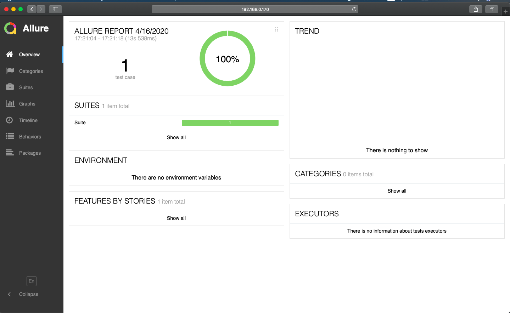
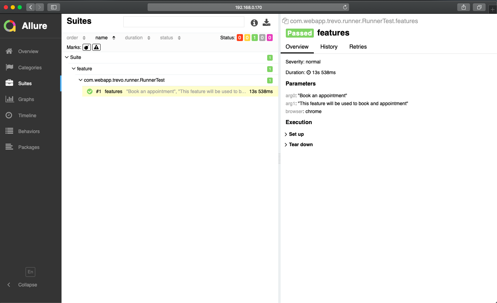
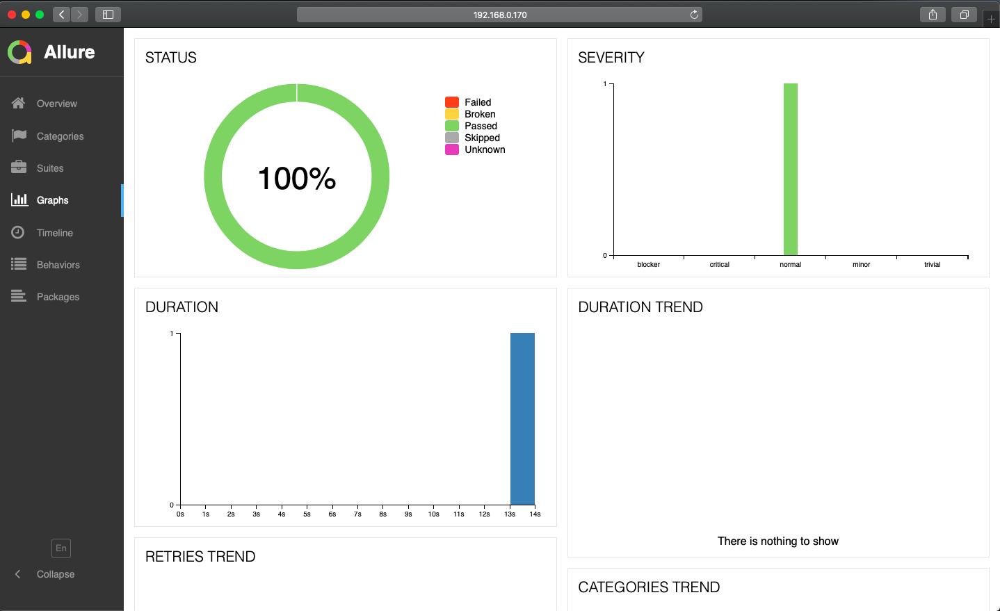

# WebAppAutomation
Web Application Automation

Framework Details:
1) BDD with Cucumber
2) Maven
3) TestNG
4) Page Factory Design Pattern
5) Selenium Grid with parallel execution support
6) Docker compose (Considering CI integration & Scaling)
7) Allure for Reporting

Projection Execution:
To execute this project there are two ways:- 
1) One is to setup selenium grid on your machine.
2) If machine is running with a docker, simply run docker-compose.yml

**A) *Running Project with a selenium grid***

Setup:
1) Download the selenium grid folder from this link [https://drive.google.com/drive/folders/1vz-cL0_8h-ch6Qni3k50MTKN2RcMEPCl?usp=sharing]()
2) Place the SeleniumGrid folder in a directory
3) Make sure you have below files in the folder
    a) hub.json
    b) node.json
    c) selenium-standalone.jar
    d) startgrid.command    
4) Open `startgrid.command` in a text editor, Replace the path of `SeleniumGrid` folder at Line no:4 and Line no:8, i.e `cd /Users/SeleniumGrid` with your `localPath`.
5) Next is to add `geckodriver` and `chromedriver` to the locals mentioned on Line no: 9. Both these drivers can be found under `src/test/chromedriver` and `src/test/geckodriver` in main project.
6) Add the above drivers to `/usr/local/bin/` of your machine.
7) Once this is done, Simply open terminal from your SeleniumGrid folder and run `./startgrid.command`. 
8) If the set has configured correctly, then you should be able to see grid console listening on `port:4444`.
9) Test this setup by accessing your locahost at [http://localhost:4444/grid/console]()
10) At the end go to project folder and Run `mvn test` command.

Note: While running tests in local machine, you can see the execution on chrome browser

**B) *Running Project using Docker Compose***
1) Assuming that Docker is already running on a machine.
2) Go to the main folder of Project Directory.
3) Run the following command `docker-compose up -d --scale chrome=1`, Please note since there is only one scenario, therefore chrome value is set to 1. It's configurable based on scenarios we want to run in parallel.
4) Once docker compose is up and running, Run `mvn test` command.
5) After the test are finished, simply take the docker compose down using `docker-compose down`.

Note: While running tests in docker execution will be headless.

**C) *Report Generation***
1) Once the test execution is over, `allure-results` folder will be generated. You can see the allure reports as well. But to visualize that you need have allure installed on your machine.

Installation : `brew install allure`

2) Once successfully installed, Go to the main project folder and run `allure-serve allure-result`
3) The above command should generate report on localhost [http://192.168.0.170:49280/index.html]()

**Please note: I've filled the booking form but didn't performed a submission to avoid submitting test data in production website.**

